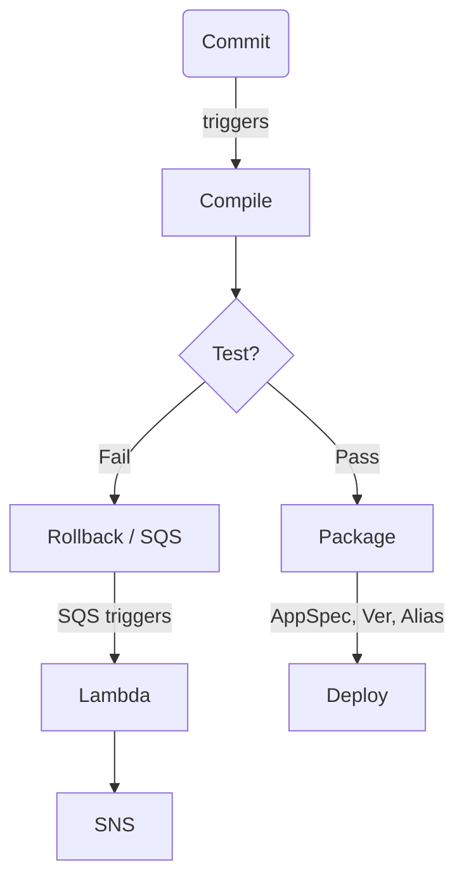

# Lambda Pipeline Brute
Boilerplate typescript-CDK that defines a Pipeline-generating Stack.
The resulting AWS Pipeline connects a GitHub repo to a Lambda handler.

The _Brute_ moniker is recognition that the pipeline is a bit crude; it uses the `Build` Stage to do the actual code deployment.

## What's in the box?
This Stack provisions a basic pipeline with 4 stages:
1. Source
   - Fetch from **configured** GitHub Repo\*
2. Compile
   - Execute the `buildspec.yml` **expected** in the source code root dir
   - The Compiled application is expected in  `<base_dir>/dist` directory. Thus, a viable artifact definition might be:
      ```yaml
      artifacts:
         base-directory: .
         files:
           - 'dist/**/*'
         discard-paths: no
      ```
3. Package
   - Zips th contents of `dist/` dir
   - Upload the zip to lambda function
   - Determine current and target lambda function versions
   - Generate `appspec.yml` for CodeDeploy
4. Deploy
   - Updates the `Alias:Version` pointers
   - Deploys according to **configured** Deployment Group template, `ALL_AT_ONCE`, `BLUE_GREEN`, etc... \*

   (* see [parameters.json](./parameters.json))

## Configuration
There are a number of steps before the Stack and pipeline will deploy/run successfully.


Configure the administrator's email (used for error notification) in [./cdk.json](./cdk.json):

```json lines
 "context": {
    "devopsEmail": "devops@exaple.com",
```

#### Component/resource dependencies:





|     | Resource              | Parameter Name                        |
|-----|-----------------------|---------------------------------------|
| 1   | GitHub Connection ARN | `handlerConnectionArnParam`           |
| 2   | Lambda Execution Role | `lambdaExecutionRoleArn`              |
| 3   | Application           | `applicationName`                     |
| 4   | S3 Bucket             | `projectBucket`                       |
| 5   | Handler Code          | `handlerRepoURL`,<br/>`handlerBranch` |


_This app was created in the **us-west-2** region. Change the regions in the URLs below to suit your set up._

1. Create a `pipeline <= GitHub` connector in the [Connections Console](https://us-west-2.console.aws.amazon.com/codesuite/settings/connections).
   - This boilerplate stores the connection ARN as an **AWS System Parameter** (cuz it's free). However, use **AWS Secrets Manager** where real security is required. If using **Secrets Manager**, find and change code around `ssm.StringParameter` in [lib/lambda-pipeline-brute.ts](lib/lambda-pipeline-brute.ts).
2. Store the ARN  in [AWS System Parameters](https://us-west-2.console.aws.amazon.com/systems-manager/parameters/)
   - Copy the param **key** from above to value of `handlerConnectionArnParam` in [parameters.json](./parameters.json)
3. Create the Role the Lambda function will run as. Save the ARN under `lambdaExecutionRoleArn` in **parameters.json**. _It is okay to use the `{{REGION}}` and `{{ACCOUNT}}` placeholders._
4. The deployment utilizes a `LambdaDeploymentGroup`. Specify the name of the Application containing this Lambda, or, if pre-existing, the **ARN**.
5. An S3 bucket to store pipeline artifacts. Name or **ARN** if pre-existing.
6. The Lambda source code the pipeline will deploy. The default handler is `index.handler`.
- Each parameter has a description in [parameters.json](./parameters.json).


## Commands

### To deploy the pipeline
* `npm synth deploy - ${functionName}`
* `npm run deploy - ${functionName}`

### Examples:
- In `parameters.json` Set
```json lines
{
   ParameterKey: "applicationName",
   "default": "NeopolitanFactory",
}
```
- `npm run deploy - Chocolate`
   - Will create a Stack, **ChocolateStack**, and a Lambda function named **Chocolate**
- `npm run deploy - Vanilla`
- `npm run deploy - Strawberry`

